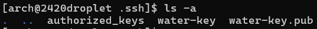

# Introduction

## About DigitalOcean

DigitalOcean is a cloud computing vendor and service provider. DigitalOcean offers multiple services, but the primary service we will be making use of in this setup guide is DigitalOcean’s Droplet. A **Droplet** is a Linux-based virtual machine that is hosted on DigitalOcean that will be a server for us to remotely access.

## Requirements

This guide is designed for users who are familiar with idea of remote cloud-based servers, what Linux is, but are not sure on how to set up a cloud-based server to host and manage. For this guide, we will be specifically using the **Arch Linux image**.

Users should also be familiar with or have:

1. what Linux is,
2. some knowledge of command-line tools
3. a DigitalOcean account
4. an Arch Linux image
## Instructions Overview

These instructions will walk you through several steps required for setting up the droplet using SSH keys, the `doctl`, and configuring cloud-init for automating the initialization.

1. Working with SSH key pairs
2. Installing `doctl` onto Local Machine
3. Configuring API Access for `doctl`
4. Uploading the Public Key to DigitalOcean account with `doctl`
5. Uploading a Custom Image to DigitalOcean with `doctl`
6. Initializing Droplet setup with Cloud-init
7. Deploying a Droplet with `doctl`
8. Connecting to your new Droplet

# Working with SSH key pairs

An **SSH key** is an authentication method used to gain access to encrypted connections. Why *use an SSH key over just a password?* Compared to an SSH Key, passwords can be considered less secure and ineffective as they can be easily cracked and can be weak.

The key pair is based on two related but asymmetric keys: a private key and a public key both creating the key pair used as a secure access credential. For the purpose of this tutorial, we will be using the SSH key pair to connect to the remote server.

## Creating the SSH Key

1. Open the **Terminal**
2. Type and run the command `cd ~` to change to your home directory
3. Type and run the command `mkdir .ssh` to make our `.ssh` directory.
	This folder is where we are storing our SSH keys
4. Type and run the command `ls -a` to list **all** the contents of the directory to confirm we have made the `.ssh` directory.


5. Type and run the command below to generate your keys.
   
```
ssh-keygen -t ed25519 -f ~/.ssh/<key-name> -C "youremail@email.com"
```

- `ssh-keygen` is the authentication key generation command
- `-t ed25519` specifies the type of key and we are using the protocol `ed25519`
- `-f C:\Users\<your-user-name>\.ssh\<key-name>` specifies the file name at our designated directory and desired key-name
- `-C "youremail@email.com"` adds a comment with our email

**Note**: Replace the text within the “<>” tags with your respective information. For example, you will replace “your-user-name” with your user found in the directory path name. You will also replace “youremail@email.com" with your desired email.

6. Type a passphrase. You will need to remember this passphrase to securely access the server we will be making.

7. Type and run the command `cd .ssh` to change our directories into the .ssh folder. Then again, run the command `ls -a` to view the contents.



- `water-key` is our private key
- `water-key.pub` is our public key that we will use to upload to our DigitalOcean account

After choosing your passphrase, at this point your SSH key pair has been created. We will need to use `doctl` to upload our public key to our DigitalOcean account. Next we will install `doctl`.
# Installing doctl onto Local Machine

`doctl` is DigitalOcean’s official command-line interface (CLI). It allows you to interact with the DigitalOcean API via the command line. For us this means it will let us create, configure, and destroy DigitalOcean resources, specifically Droplets.

**Warning**: When running the following commands in the Terminal, ensure that it is **Run as Administrator**

1. In the **Terminal**, type and run **the command below** to download the most recent version of `doctl`:

```
sudo pacman -S doctl
```

- `sudo` is for ‘superuser do’, which will temporarily elevate to root user privileges to run the next following commands.
- `pacman` is our package manager for the official Arch Linux repository to download the `doctl` package
- `-S` specifies to sync or install only

If installation or packages fail: 

1. Type **the command below** to update the package manager:
```
sudo pacman -Syu
```

- `-y` flag specifies to refresh the local cache
- `-u` flag specifies to system update

After the update, attempt to install the `doctl` package again.

After the installation, we cannot quite use `doctl` yet. We will have to authenticate the DigitalOcean API to allow it access to `doctl`.
# Configuring API Access for doctl

To manage our droplet, we would need to use the DigitalOcean API, but we will need to configure who we want to use the API and access our servers. Users will use the Personal Access Token to authenticate themselves and request access to the API to use `doctl`.

## Generating API Token

1. Click **API** on the left navigation bar


2. Click **Generate New Token**
3. Type `<your-Token-Name>` and choose the **Full Access** scopes.
4. Click **Generate Token


5. Copy and Paste the **personal access token**

**Caution**: Token is shown only once, copy and paste this token somewhere safe.

## Granting account access to `doctl`

1. In the **Terminal**, type and run **the command below** to grant `doctl` access:
   
```
doctl auth init --context <NAME>
```

This command allows you to initialize `doctl` with a token so you will be able to query and manage account details and resources. Give the authentication context a name and replace `<NAME>`.

2. Paste in your **personal access token** that you have stored
   


3. Type and run **the command below** to switch to the context with that we just named
   
```
doctl auth switch --context "your-context-name"
```

- `doctl auth switch` allows you to switch between authentication contexts you have already created

5. Validate that `doctl` is working by running:
   
```
doctl account get
```

- `doctl account get` is used to retrieve the details from your account profile.

If successful your output should look like:
```
User Account          Team     Droplet Limit   Email Verified  UUID             Status
youremail@email.com  My Team         10           true         <uuid-numbers>   Active 
```


Now that we have successfully configured `doctl`, we can start using it, first by adding the SSH public key we created to our DigitalOcean account.
# Uploading the Public Key to DigitalOcean account with `doctl`

We will be using `doctl` to grab and upload our public key to our DigitalOcean account.

1. In the **Terminal**, type and run **the command below**:
   
```
doctl compute ssh-key import "My SSH Key" --public-key-file ~/.ssh/<key-name>.pub
```

- `doctl compute ssh-key import "My SSH Key"` is the subcommand of `doctl` that imports an existing SSH key from our local machine to our account. We would replace “My SSH Key” with the key name we want it to be named on the DigitalOcean account.
- `--public-key-file` specifies that we want a public key file
- `~/.ssh/<key-name>.pub` specifies the path we point to our public key file, if you are already in the home directory, you can try just a relative path of `.ssh/<key-name>.pub`

If successful, you should see an output that looks like:
```
ID           Name              FingerPrint
43529188     droppy-guide      e2:d3:81:c3:60:8f:97:47:2a:2d:5e:53:79:ec:49:97
```

You can also validate your list of SSH keys and key ID any time with the command:
```
doctl compute ssh-key list
```

Next we have to upload our custom image of Arch Linux onto DigitalOcean to use for our remote server.
# Uploading a Custom Image to DigitalOcean

Custom images are Linux distributions. The custom image we will be working with in this tutorial is Arch Linux, a lightweight and flexible Linux distribution. We will learn to upload this custom image to our DigitalOcean account to create our server with our preferred image.

1. Click **Manage** on the left navigation bar


2. Click **Backups & Snapshots**
3. Click **Custom Images** > **Upload Image**
4. Navigate to the **Arch Linux custom image** that you have downloaded onto your local machine
5. Select **Arch Linux** for Distribution and **San Francisco** Server **3**


# Initializing Droplet setup with Cloud-init

Cloud-init is a utility that automates the initialization of cloud instances and uses the YAML-formatted configuration file to apply user-defined tasks. In our case, we are using the cloud-init file to automate our droplet setup and include packages we want in the droplet.

**YAML** is a programming language designed to be easy to read and understand as it is a human-readable data serialization language. These are often used for configuration files.

We will also need to download the package **Neovim** which is a text editor based off another text editor called **Vim**.

1. Type and run **the command below** to install neovim:
```
sudo pacman -S neovim
```

2. Type and run **the command below** to create our cloud-init YAML file:
```
touch cloud-init-arch.yaml
```

- `touch` is a fundamental Linux command and tool to create empty files
- `cloud-init-arch.yaml` is our file name with extension `.yaml`

Remember to run the command `ls -a` to see if our `yaml` file is successfully created.

!(Check for YAML File)[yaml-file-check.png]
## Editing the cloud-init file with Neovim

1. Run the command below to edit our `yaml` file so we can choose our configurations for cloud-init
   
```
nvim cloud-init-arch.yaml
```

- `nvim` calls our text editor Neovim to open a specified file `cloud-init-arch.yaml`   

2. While in Neovim enter INSERT mode by **pressing** the `I` key. You will see on the bottom left it will say INSERT to show you are in the mode. 


3. Copy and paste the following code below into our YAML file we created.

```YAML
#cloud-config
users:
  - name: <Your-Name-Here>
    sudo: ['ALL=(ALL) NOPASSWD:ALL']
    shell: /bin/bash
    ssh-authorized-keys:
      - ssh-ed25519 <your-public-key-here> <your-email-here>

packages:
  - neovim
  - nginx
  - fd
  - less
  - bash-completion

disable_root: true
```

- `users`: adding users to the system
- `name`: the name of the user
- `sudo`: allows this created user unrestricted access
- `shell`: specifies the path of the shell
- `ssh-authorized-keys`: specifies the SSH keys that are added to user’s authorized keys file
- `packages`: specified packages to install on first initialization
- `disable_root: true`: specifies to disable root login via SSH. We do this so the server cannot be logged in even if the root account password is cracked

4. Exit INSERT mode by pressing the `ESCAPE` key
   
5. Type `:wq` to write what you have pasted and quit the Neovim editor.
   - `w` writes to our file
   - `q` quits the text editor

We have successfully configured our cloud-init file. 

# Deploying a Droplet with doctl

1. Type and run **the command below** like we did earlier to find and note our key id with:
```
doctl compute ssh-key list
```

2. Take note of the key ID belonging to the SSH key pair we created.
3. Type and run **the command below** to find the ID of course custom image we uploaded:
```
doctl compute image list-user
```

4. Type and run **the command below** to deploy our droplet:
```
doctl compute droplet create --image <Image-ID> --size s-1vcpu-1gb --region sfo3 --ssh-keys <Key-ID-Here> --user-data-file <path-to-your-cloud-init--yaml-file> --wait <Droplet-Name>

```

- `doctl compute droplet create`: The command `doctl` requires to create Droplets onto your DigitalOcean account. It requires values for the `--image` and `--size` flags.
- `--image <Image-ID>`: The OS image used to create the Droplet. In this case we point it to our custom image ID we uploaded. For example: `--image 166429465`
- `--size s-1vcpu-1gb`: The number of processors and the amount of RAM each Droplet has. In this case, each Droplet has one processor and 1 GB of RAM.
- `--region sfo3`: The region to create the Droplets in. In this example, `doctl` deploys the Droplets into the SFO3 datacenter region.
- `--ssh-keys`: The SSH keys to import into the Droplet from your DigitalOcean account. You can retrieve a list of available keys by running `doctl compute ssh-key list`
- `--user-data-file <path-to-your-cloud-init-yaml-file>`: Specifies the path to your `cloud-config.yaml` file. For example, `~/cloud-config.yaml`.
- `--wait`: Tells `doctl` to wait for the Droplets to finish deployment before accepting new commands.
- `<Droplet-Name>`: The names of the Droplets being deployed. You can deploy as many Droplets as you like by providing a name for each Droplet at the end of the command.

**Caution**: Replace your text and values in the “<>” tags like the Image-ID and Key-ID making sure they match the exact ID values you found running the previous commands.


5. To validate your droplet has been created, you should have seen an output listing its details, also you can run the command:
```
doctl compute droplet list --format ID,Name,PublicIPv4,Region
```

- `doctl compute droplet list`: The command `doctl` requires to print the list of droplets on your account.
- `--format`: We specify which values to print out specifically the `ID` of the droplet, the `name`, `Public IPv4` and `Region`.

6. Copy the IPv4 address down to configure our config file

# Connecting to your new Droplet

This is the last step to our server! We secured access, configured the initialization, deployed it. Now we just need to connect to it via SSH.

**Note**: Keep in mind the Public IPv4 Address that we have kept and saved. Also, Steps 1 - 4 are **optional**.

1. Navigate to your `.ssh` directory
2. Create the config file by running the command `nvim config`
3. Copy and paste the following code into the text editor:

	Remember to go into INSERT mode with pressing the `I` key
```
Host <Host-Name>
	HostName <Public IPv4 Address>
	User root
	PreferredAuthentications publickey
	IdentityFile ~/.ssh/<key-name-here>
	
```

4. After pasting and replacing the details, write and save the config file with `:wq`
5. Connect to your new deployed droplet by typing the following commands:

If you created the config file:
```
ssh <host-name>
```

If you skipped steps 2 - 4:
```
ssh -i ~/.ssh/<key-name> <username>@<Public IPv4 Address>
```

6. Type **your passphrase** to your SSH key that you have saved


Success! You have connected to your new droplet! You can always exit with `exit` and reconnect.
# References

https://docs.redhat.com/en/documentation/red_hat_enterprise_linux/9/html/configuring_and_managing_cloud-init_for_rhel_9/introduction-to-cloud-init_cloud-content
https://docs.redhat.com/en/documentation/red_hat_enterprise_linux/9/html/configuring_and_managing_cloud-init_for_rhel_9/introduction-to-cloud-init_cloud-content#cloud-init-operates-in-stages_introduction-to-cloud-init
https://cloudinit.readthedocs.io/en/latest/reference/examples.html